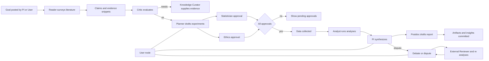

# Design Doc: Research Lab

## Requirements


- Build a transparent multi-agent Research Lab where each lab role is a persistent node (PI, Postdoc, PhD, Reader, Critic, Analyst, Planner/Statistician, Ethics Officer, Coordinator, Knowledge Curator, External Reviewer, and User).
- Maintain an append-only shared transcript with provenance; render as chat and as a directed reasoning graph.
- Real-time updates to the React frontend via WebSockets or SSE.
- Backend in Rust (axum) with an in-process orchestrator and lightweight worker tasks for agents.
- Storage in local filesystem (JSONL + folders) to keep MVP simple yet swappable for a DB later.
- Decision gates: execution of plans requires Statistician and Ethics approvals; high-impact actions require PI sign-off.
- Debate loop: agents discuss until convergence; PI has higher authority and dominates ties; the User can adjudicate/override, which immediately finalizes (and is recorded with rationale).
- Final survey report: after analyses and reviews, generate a consolidated PDF survey and store it as an artifact with provenance.

## Flow Design

### Applicable Design Pattern:

1. Agent pattern for multi-role orchestration and debate.
2. Workflow (gated) for approvals and execution readiness.
3. Optional RAG for Reader/Curator (paper ingestion and evidence retrieval) later.

### Flow high-level Design:

1. **Goal Posted (PI/User)**: Open a research topic; orchestrator initializes context.
2. **Reader & Curator**: Survey literature; extract claims and evidence snippets.
3. **Critic**: Challenge claims; request verification or clarity.
4. **Planner/Statistician**: Draft experiment; compute power/sample size; request approvals.
5. **Ethics Officer**: Review compliance; issue ethics approval.



## Utility Functions

 

1. **Append-only Writer** (`backend/storage/append.rs`)
   - Input: line (JSON), path
   - Output: persisted line; fsync
   - Necessity: Durable transcript/graph/debate logs.

2. **Event Bus** (`backend/core/events.rs`)
   - Input: event struct
   - Output: broadcast to WS and workers
   - Necessity: Realtime UI + agent coordination.

3. **Graph Delta Builder** (`backend/graph/delta.rs`)
   - Input: message/debate event
   - Output: node/edge deltas
   - Necessity: Interactive reasoning graph.

4. **Debate Tally** (`backend/orchestrator/debate.rs`)
   - Input: proposals, votes, authority weights
   - Output: current leader, stability
   - Necessity: Consensus and PI dominance logic.

5. **Frontend WS Client** (`frontend/src/lib/ws.ts`)
   - Input: URL, handlers
   - Output: event stream callbacks
   - Necessity: Live transcript/graph updates.

## Node Design

### Shared Store

 

The shared store structure is organized as follows:

```python
shared = {
    "key": "value"
}
```

Additional clarifications for this project:
- Persist authoritative state on disk (append-only files). In-memory cache mirrors recent windows for performance.
- Maintain per-debate and per-day transcript logs to avoid large file growth.

### Node Steps

 

1. Goal Node (PI/User)
  - *Purpose*: Introduce or refine research goals/topics.
  - *Type*: Regular
  - *Steps*:
    - *prep*: Validate topic; initialize context
    - *exec*: Append `goal_posted` message; emit graph delta
    - *post*: Notify Reader/Critic

2. Claims & Evidence (Reader/Curator)
  - *Purpose*: Ingest papers; extract claims and evidence.
  - *Type*: Async (can run concurrently)
  - *Steps*:
    - *prep*: Fetch docs; retrieve prior related messages
    - *exec*: Append `claim` with links to evidence
    - *post*: Notify Critic

3. Planning & Approvals (Planner/Statistician, Ethics)
  - *Purpose*: Draft experiment and obtain required approvals.
  - *Type*: Workflow (gated)
  - *Steps*:
    - *prep*: Aggregate requirements and constraints
    - *exec*: Append `plan_draft`; orchestrator creates pending `{statistical:false, ethics:false}`
    - *post*: On approvals, emit `execution_ready`

4. Debate Session (All relevant roles)
  - *Purpose*: Resolve disagreements with weighted consensus; PI dominance; user adjudication.
  - *Type*: Async session
  - *Steps*:
    - *prep*: `debate_opened` with participants and scope
    - *exec*: `proposal`/`challenge`/`vote`; orchestrator tallies with authority weights
    - *post*: `finalized` via stability, PI finalize, or user adjudication

5. Analysis & Synthesis (Analyst, PI, Postdoc)
  - *Purpose*: Run analyses, produce artifacts, and draft report.
  - *Type*: Regular
  - *Steps*:
    - *prep*: Access data and plan parameters
    - *exec*: Append `analysis_result`; link artifacts
    - *post*: PI `synthesis` and Postdoc `report_draft`

## Final Survey Report (PDF)

### Purpose
- Produce a consolidated, human-readable survey of the research after analyses and reviews are complete.
- Ensure transparency by embedding provenance links to transcript messages, decisions, and artifacts.

### Trigger and Preconditions
- Triggered when:
  - Required approvals for the plan are completed (Statistician + Ethics) and
  - Relevant debates for the topic are finalized (or adjudicated by User/PI) and
  - The PI synthesis and Postdoc report draft exist (minimum content base).
- The UI shows a "Generate Final Survey PDF" action when preconditions are met.

### Content Structure (MVP)
- Cover: Project title, date/time, version, authorship (agents + user)
- Executive Summary: goals, key findings, conclusions
- Methods: plan summary, approvals, constraints
- Results: analyses with select plots/tables (linked artifacts)
- Decisions: approvals, overrides, disputes and resolutions
- Provenance Appendix: message IDs, links, tools used, confidence notes

### Storage and Provenance
- Path: `data/artifacts/reports/<timestamp>_final_survey.pdf`
- A transcript message is appended with `type: "report_generated"`, `artifacts: [path]`, and provenance linking inputs (messages/artifacts/decisions used).
- Graph delta adds a node for the PDF artifact and `derives_from` edges to inputs.

### API (axum)
- `POST /api/report/final_survey` → kicks off report generation, returns artifact id/path
- `GET /api/artifacts/:id` → streams/downlinks the artifact
- Events: `artifact_created` and `message_appended` emitted on completion

### Frontend (React)
- Button in Pending/Actions or Report area: "Generate Final Survey PDF"
- Shows progress, completion toast, and a link to open/download the PDF
- Report node appears in GraphView; entry appears in TranscriptView with provenance

### Utilities (Backend)
- `backend/report/pdf.rs` (HTML-to-PDF adapter)
  - Input: structured report data (title, sections, artifact links)
  - Output: PDF file at path above
  - Implementation: render HTML template and convert to PDF (adapter swappable; MVP can shell out to a local tool or use a Rust crate)
- `backend/report/assemble.rs`
  - Collates required messages/artifacts by query (goals, approvals, analyses, debates)
  - Produces a deterministic report data structure (schema-versioned)

### Testing
- Unit: assemble function selects correct inputs; PDF generator invoked with stable template
- Integration: run end-to-end scenario → generate PDF → verify transcript message and artifact node appear and link correctly
